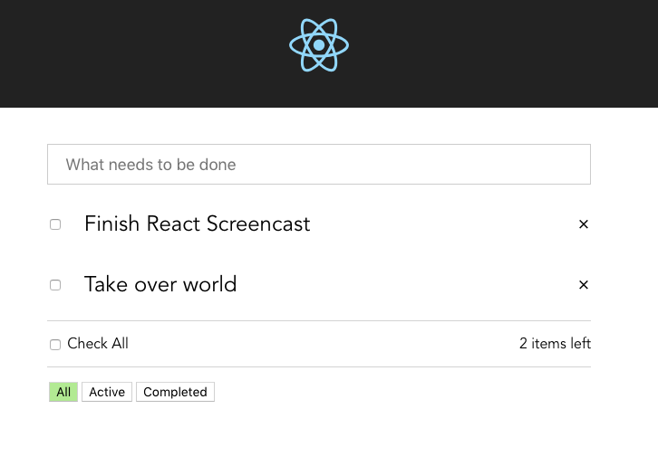

 

Code for YouTube Series on building a Todo App using React.js: [YouTube Link](https://www.youtube.com)

###### **Note:** Each video has a corresponding branch. The master branch is up to date with the latest video.

# Build Setup

<mark> \# install dependencies

npm install

\# serve at localhost:3000

npm start
</mark>

# Specific Branch

faisal
 
If you want to checkout a certain branch:

> `it branch -a` to list all the branches.

<mark>git checkout 01-basics</mark> (or any branch) to check it out.

# Laravel API

The Laravel API repo can be [found here.](https://github.com/drehimself/todo-laravel)
